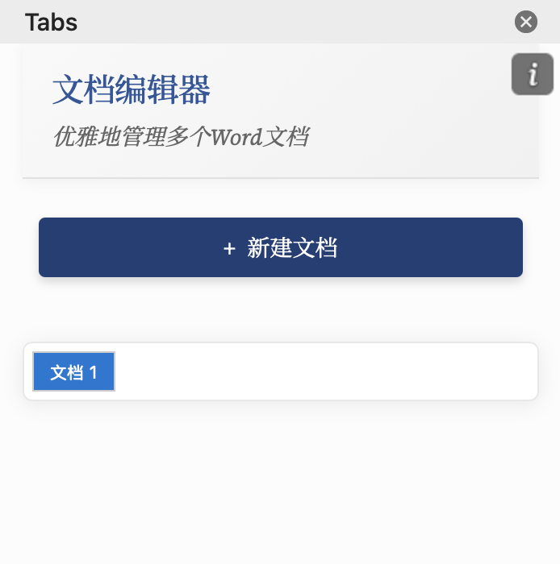

# Word多标签编辑器

## 项目简介

出于自己写作的需求，写了这一个插件：Word多标签编辑器。它是一款为Microsoft Word设计的插件，允许用户在同一个Word窗口中同时管理和编辑多个文档，类似于浏览器的多标签体验。这款工具提高了文档操作效率，特别适合需要在多个文档间频繁切换的场景。

后续还会添加一些功能，初心是拿来自己用的。

### 项目展示图

## 核心功能

- **多文档管理**：在单个**Word窗口**中创建、切换和管理多个文档

> 还未实现单个标签页管理多个窗口，敬请期待

- **即时切换**：一键在不同文档间切换，无需打开新窗口
- **优雅界面**：采用现代化UI设计，轻松直观的操作体验
- **文档独立性**：每个标签页中的文档相互独立，互不影响
- **响应式设计**：适应不同窗口大小和设备

## 安装指南

### 环境要求

- Node.js 14.0+
- npm 6.0+
- Microsoft Word (桌面版)

### 步骤
1. 克隆本仓库：`git clone https://github.com/yssysu/Word-Pluging-TAB-MacOS.git`
2. 进入项目目录：`cd Tab/TAB`
3. 安装依赖：`npm install`
4. 构建项目：`npm run build`
5. 部署到Word：`npm run start`

## 使用指南

### 基本操作

1. **创建新文档**：点击界面顶部的"+ 新建文档"按钮
2. **切换文档**：点击任意标签页切换到相应文档
3. **重命名文档**：双击标签名称，输入新名称后按Enter确认
4. **关闭文档**：点击标签页上的"×"按钮
5. **保存文档**：在不同标签页下使用另存为进行保存，注意文档的重命名

### 文档编辑

- 在活动标签页中的编辑操作会实时保存到该文档
- 切换标签页不会影响其他文档的内容
- 所有标准Word编辑功能在每个标签页中均可正常使用

## 项目结构
word-multi-tabs/
├── src/
│   ├── taskpane/
│   │   ├── taskpane.html # 主界面HTML
│   │   ├── taskpane.css # 样式表
│   │   └── taskpane.js # 主要业务逻辑
│   ├── manifest.xml # Office加载项清单
│   └── ...
├── assets/ # 图片和图标
├── config/ # 项目配置文件
├── .eslintrc.json # ESLint配置
├── package.json # 项目依赖
└── README.md # 项目说明文档

## 技术栈

- **前端框架**：原生JavaScript
- **UI组件**：Microsoft Fluent UI
- **开发工具**：Office.js API, Webpack, Babel
- **字体**：Source Serif 4, Noto Serif SC